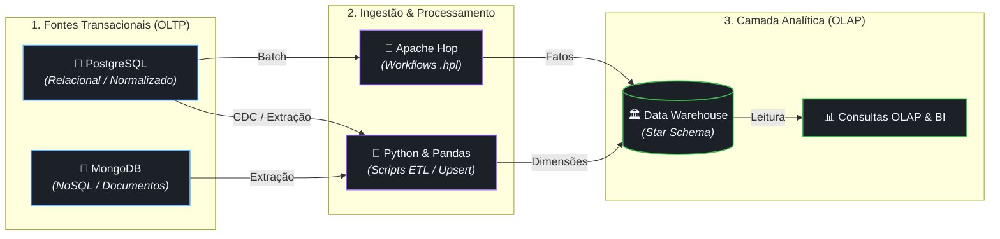

# Data Engineering & Analytics Modernization


## Sobre o Projeto

O projeto simula um ciclo completo de dados: uma base transacional relacional (PostgreSQL), a migração para um modelo orientado a documentos (MongoDB) e a criação de um Data Warehouse analítico (Star Schema) via processos ETL em Python.

## Diagrama de Arquitetura



## Estrutura e Camadas do Projeto

### `01-relational-postgres/` (Camada Transacional OLTP)
Opera sobre PostgreSQL na 3ª Forma Normal (3FN), focado em consistência ACID. Inclui a aplicação Flask original do portal universitário. O modelo normalizado protege a integridade dos dados durante a escrita, mas exige múltiplos JOINs que lentificam a leitura de agregados.

### `02-nosql-mongodb/` (Migração e Operação NoSQL)
Implementa a versão orientada a documentos (MongoDB) do banco de dados. A desnormalização acelera o acesso conjunto às informações, porém introduz a necessidade de atualizações múltiplas. Como o MongoDB não assegura chaves estrangeiras, a integridade referencial é delegada para a aplicação, sendo gerida no Flask e validada via JSON Schema.

### `03-data-warehouse-etl/` (Camada Analítica DW & OLAP)
Centraliza a estrutura dimensional (Star/Snowflake Schema) otimizada para leitura agregada. O isolamento no Data Warehouse previne que consultas pesadas de relatórios consumam recursos da base de produção. A carga é realizada por pipelines extraindo da base relacional e do MongoDB usando Pandas (`etl_pandas_dw.py`) e Apache Hop (`.hpl`).

### `docs/`
Mapeamentos de esquema, diagramas e relatórios de implementação técnica.

## Execução

### 1. Clonar o Repositório
```bash
git clone https://github.com/seu-usuario/Engenharia-de-dados.git
cd Engenharia-de-dados
```

### 2. Configurar o Ambiente Virtual
```bash
python3 -m venv venv
source venv/bin/activate  # No Windows use: venv\Scripts\activate
pip install -r requirements.txt
```

### 3. Configurar as Variáveis de Ambiente
Copie o modelo de variáveis para criar o arquivo `.env`. Edite-o informando os URIs locais ou em nuvem para o PostgreSQL e o MongoDB:
```bash
cp .env.example .env
```

### 4. Executando os Módulos

**Módulo Relacional (PostgreSQL):**
```bash
cd 01-relational-postgres
# Certifique-se de que o banco PostgreSQL está rodando
python app2.py
```

**Módulo NoSQL (MongoDB):**
```bash
cd 02-nosql-mongodb
# Realiza carga/upsert no banco
python ETL.py --apply
# Inicia a aplicação web
python app.py
```

**Módulo Data Warehouse:**
```bash
cd 03-data-warehouse-etl
# Roda a extração em Pandas
python etl_pandas_dw.py
```
